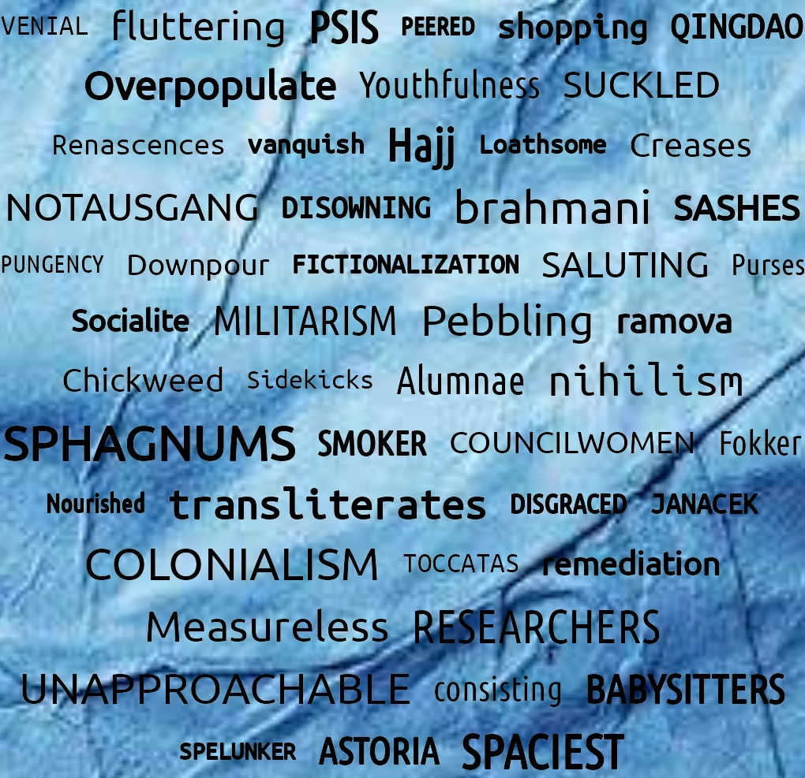
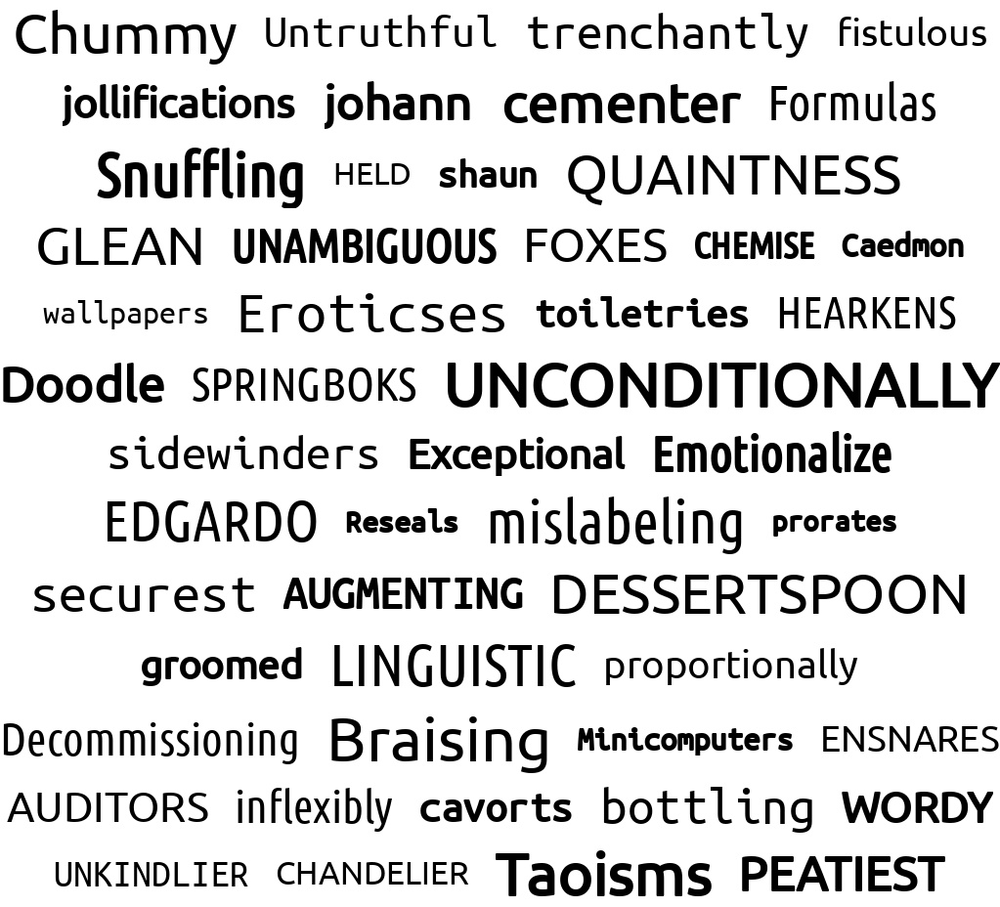

<div align="center">

# SynthTIGER 🐯 : Synthetic Text Image Generator

Synthetic Text Image Generator for OCR Model | [Paper](https://arxiv.org/abs/2107.09313) | [Documentation](https://clovaai.github.io/synthtiger/) | [Datasets](#datasets)

</div>


说明文档/[原项目说明](README_EN.md)

# 简介

本项目继承自[synthtiger](https://github.com/superocr/synthtiger)，拓展其生成多语言文本检测、文本识别训练数据集的能力。

# 特性

- [x] 支持多行文本生成返回文本框坐标信息
- [x] 支持返回PaddleOCR格式标签
- [x] 支持多行文本生成使用图片作为背景：添加参数background
- [x] 支持中文语系、拉丁语系、阿拉伯语系、西里尔语系、元音附标语系

# 安装

```bash
conda create -n synthtiger python=3.7
```

```bash
conda activate synthtiger 
```

```bash
pip install synthtiger
```

# 使用

## 文本识别

要生成用于某个语言的文本识别训练数据，需要准备以下内容：

- 字典
- 字体
- 背景
- 语料
- 配置文件

下面我们以构建一个英语数据集为例，

- 字典准备

我们需要准备一个形如[en_dict.txt](./resources/charset/en_dict.txt)的txt文件，里面包含你所需要生成所有可能的字符。

你可以手动编辑生成该文件，当然你也可以准备一个形如[en_charsets.txt](./resources/charset/en_charsets.txt)的文件，尽管将所需字符放置于该txt文件中即可，然后执行如下生成字典的命令：

```bash
python tools/generate_dict.py \
		--charsets_txt_path ./resources/charset/en_charsets.txt
		--dictionary_txt_path ./resources/charset/en_dict.txt
```

此时我们将得到一个所需字典文件[en_dict.txt](./resources/charset/en_dict.txt)。

- 字体准备

下载支持该语言的字体文件，并放置于[font](./resources/font)下的独立文件夹下,比如我们将我们准备的字体都放置于[latin_en](./resources/font/latin_en)文件夹下，然后我们执行如下命令：

```bash
python tools/extract_font_charset.py -w 4 ./resources/font/latin_en/
```

执行完成后，代码会对你的字体进行审核，同时生成一个字体支持字符的txt文件位于[latin_en](./resources/font/latin_en)文件夹下。

- 背景准备

  我们时常期望我们所生成的图片具有更丰富的背景图片，所以你可以选择自定义你自己的背景数据集，你需要准备一些自己的背景图片放置于./resources/image文件夹下，然后执行如下命令：

  ```bash
  python tools/create_colormap.py --max_k 3 -w 4 ./resources/images/ ./resources/colormap/colormap.txt
  ```

  该命令会生成一个[colormap.txt](./resources/colormap/colormap.txt)文件。

- 语料准备

如何获得大量的训练语料也是一个问题，尤其是涉及到多语言的问题时，获取语料更是一个令人头疼的事。这里推荐使用，[wikiextractor](https://github.com/superocr/wikiextractor)来获取该语种的文章，该项目可以从维基百科上获取对应语言的文章，形如[ug](./resources/data/ug/)文件夹下的内容(此处我们以维吾尔语为例)。

获取得到的文章数据我们还需要对它们进行切割处理，变成适合本项目的语料格式，形如[test.txt](./resources/corpus/latin/en/test.txt)。我们可以执行以下命令进行转换:

```bash
python tools/generate_corpus.py \
        --wikidata_path resources/data/ar/ \
        --dictionary resources/charset/ar_dict_v3.txt \
        --output resources/corpus/arabic/ar \
        --data_expansion_factor 1 \
        --max_text_length 25 \
```

其中，

wikidata_path：从维基百科下载的文章数据所在路径

dictionary：该语言所对应的字典

output: 输出语料存放路径

data_expansion_factor: 语料扩充倍数,在生成语料不足的情况下可以讲此参数设置大一些

max_text_length: 最大文本长度

执行完成后，我们会在你所指定的output文件夹下得到一个训练语料(train.txt)和测试语料(test.txt)。

- 修改配置文件

可对我们提供的两个配置文件模板进行修改[config_horizontal.yaml](./examples/synthtiger/config_horizontal.yaml)(用于生成水平文本图片)，[config_vertical.yaml](./examples/synthtiger/config_vertical.yaml)(用于生成竖直文本图片)，可配置其语料、字体、背景图片等信息。

- 生成图片

执行图片生成代码，

```
# horizontal
synthtiger -o results -w 4 -v examples/synthtiger/template.py SynthTiger examples/synthtiger/config_horizontal.yaml

# vertical
synthtiger -o results -w 4 -v examples/synthtiger/template.py SynthTiger examples/synthtiger/config_vertical.yaml
```


- 数据格式转换（只针对阿拉伯语系）

由于阿拉伯语系文字（包括阿拉伯文、维吾尔文、波斯文等）是从右往左进行书写的，当存在从右往左进行书写的文字与从左往右书写的文字在同一行中时会存在bidi问题，我们需要对阿拉伯语系的数据集进行格式转换以处理该问题，我们提供了转换代码，只需执行如下命令：

```bash
python tools/transform_arabic_label.py \
         --label_path ./arabic_fa_synthtiger_train/gt.txt
```

其中，label_path指生成数据的标签文件所在路径。执行完成后，我们便可以在同级目录下得到一个gt_transform.txt的转换后标签文件。


## 文本检测

```
synthtiger -o results -w 4 -v examples/multiline/template.py Multiline examples/multiline/config.yaml
```



通过config.yml中的background参数可控制是否使用图片作为背景。

